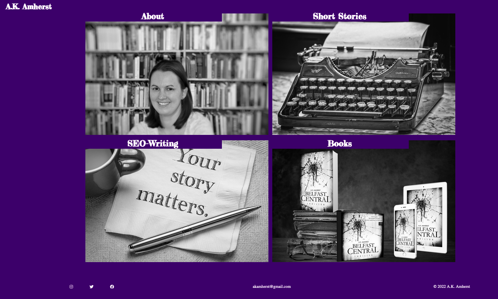

# A.K.Amherst

## Welcome To A.K. Amherst's Writer Website!

When visiting the writer's website of A.K. Amherst the user is presented with 4 sections to choose from: About, Books, Short Stories and SEO writing. Clicking on the picture and heading of one section directs the users to the corresponding subsection.

The website is targeted at two types of users. One, the fiction readers searching for interesting novels and short stories to read and the business users who are searching for a good writer for their SEO projects (blogs, website texts etc.).

By showcasing her fictional work, A.K. Amherst shows her writing talent and variety to both type of users. While the Books and Short Story sections are mainly targeted at fiction readers , they showcase her writing style and capability for the business users as well. The short story section is leading to further subpages, each subpage showing one free short story to read. 

The SEO writing section is targeted mainly at the business users but  also offers interesting information for fictional readers. After all, fictional readers may need a business writer as well or know someone who does.

In the About section the writer gives background information about herself and her writing career - which addresses both user types. After all, no matter what they seek - fiction or business writing - they will most likely want to know more about the writer behind it. 

# Responsiveness
All the main page, all 4 sub sections and the short story subpages are responsive as shown in detail below.

## Main Page

## Sub Sections 

### About

### Books

### Short Stories

### SEO Writing

# Features Overall

## Navigation Bar
On top of each page there is a logo allowing the user to go back to the main page. On top of each subsection there is a navigation bar allowing the user to switch between the sub sections. - Since the main page showcasts the four main sections at its center, the navigation bar was not added to the main page. 

## Start Page
The main page is divided in 
    a) a header with the A.K. Amherst Logo
    b) a footer with links to the social media channels (instagram, facebook and twitter), display of email address and copyright
    c) a main section displaying the options to choose from - About, Books, Short Stories, SEO 

## About Page

------

## Technologies

### Languages Used

HTML
CSS

### Frameworks, Libraries & Programs Used

1. Google Fonts: Google Fonts was used to import the two fonts "Fredericka the Great" and "Oswald" into the css stylesheet. The fonts are on all pages of this project.
2. Font Awesome: Font Awesome was used to import icons for the social media links in the footer.

## Credits

### Code

1. The following ideas came from the Love Running Project:
    a) setting box-model elements to zero/none in the css stylesheet.

    b) doing the menu as an unordered list

    c) how to create responsiveness for the header.
2. My mentor introduced me to the CSS command flex which opened completely new doors regarding my front page and many other elements in the code.

## Style

1. Font choice: The wireframe worked with the heading font Chalkduster. Since this font was not available by Google fonts, Frederika the Great was suggested by Graphichow (https://graphichow.com/knowledge/what-is-a-chalkboard-font-2/). Thus, this font was chosen as a heading font. Since Google Fonts doesn't the pairing feature anymore the developer googled for pairing fonts and found the recommendation to use Oswald. This recommendation was given by Easil (https://about.easil.com/free-font-pairing-guide-templates/)

2. There are four different page designs on website: 
    
    a) the title page

    b) the subpages main design (about, seo writing, books)

    c) the short stories design (choice of articles menu)

    d) the reading pages of short stories
3. Since the front page already displayed the main navigation, me and my mentor decided that a navigation bar at the top would be repetitive. Still, we decided to add a header and footer for consistency.
4. The main goal of the design was to keep it simple and guarantee that the user has a good overview of the divers content (audio, video, extracts, texts ...) at all times.

### Content

The content of the website was created by me, the developer and writer behind A.K. Amherst.

### Media

The media used on this website was either produced by me or bought for commercial use (e.g. the footage of the book trailer). While the reading extract was layouted by the graphic designer Grit Bomhauer, the press portfolio was designed by me.

## Debugging
### TitlePage

Through out the process of coding the website and its functionalities were tested. The Dev Tools were used for debugging and responsive design decisions.
The main issue while coding this page was indeed the front page with the four tiles at its center. I tried a lot with the float command before being introduced to the flex command by my mentor. In both cases the main challenge was to align the picture tiles and the text captions on top in the same position.
Through research on the net I am aware that such features are far easier to implement with JavaScript. Still, flex is a very good method to go what I aimed to do: visualize the pages content in a 4-split-screen.

### Footer
Another issue I faced during coding was the footer. I imagined to have the 3 social media icons with a decent padding on the left, the email contact in the middle and the copright text on the right. I also wanted to solve this with flex, after being introduced to it. But each time I tried to align the elements, the 3 social media icons were squeezed together. This could be solved by introducing 3 divs in the footer.

### Header
Although, I am aware that the header could be done with flex as well - I even had it in one of the early coding version, I felt like using another approach to train multiple different commands in CSS and HTML and not get to fixed on flex alone.

### Lessons Learned
Through trial and error I managed to program the website I wanted. The main lessons learned were:
1) the level of divs used is very important
2) being careful what I target - sometimes I targeted the div instead of the e.g. h2 inside and wondered why the CSS command was not working.
3) I learned a lot about responsive design - this was a huge process of trial and error.

## Testing
The index page as well as all subpages were tested with the W3 validator. The index.html file didn't have any errors or warnings:

.

On the subpage shortstories was a bad practice of using a button as a child of an achor tag. I fixed this by creating an anchor tag and styling it as a button. There were a few "loose" closing tags of paragraphs around that I got rid of quite efficiently with this testing. The iframes had values by default that were not needed and also deleted by me throughout this testing.
There also appeared warnings about the use of h1 headings in articles. Since I discussed this with my mentor beforehand and he said it was fine to do it like this, I ignored these warnings on purpose:

.

The CSS validator showed no errors for the style.css. For the subpages I had twice used as semi-colon instead of a colon to end a width command. And the color white was not enter properly once. Both mistakes were erased.

.

### Acknowledgements

Thanks to my mentor who believed in me and this project. His advice and tips were precious and I learned a lot. 

Also thanks to the great teachers at Code Institute and the amazing tutors. The one time I needed a tutor - when first setting up Gitpod - the support was friendly, fast and reliable. 

---
Happy surfing!